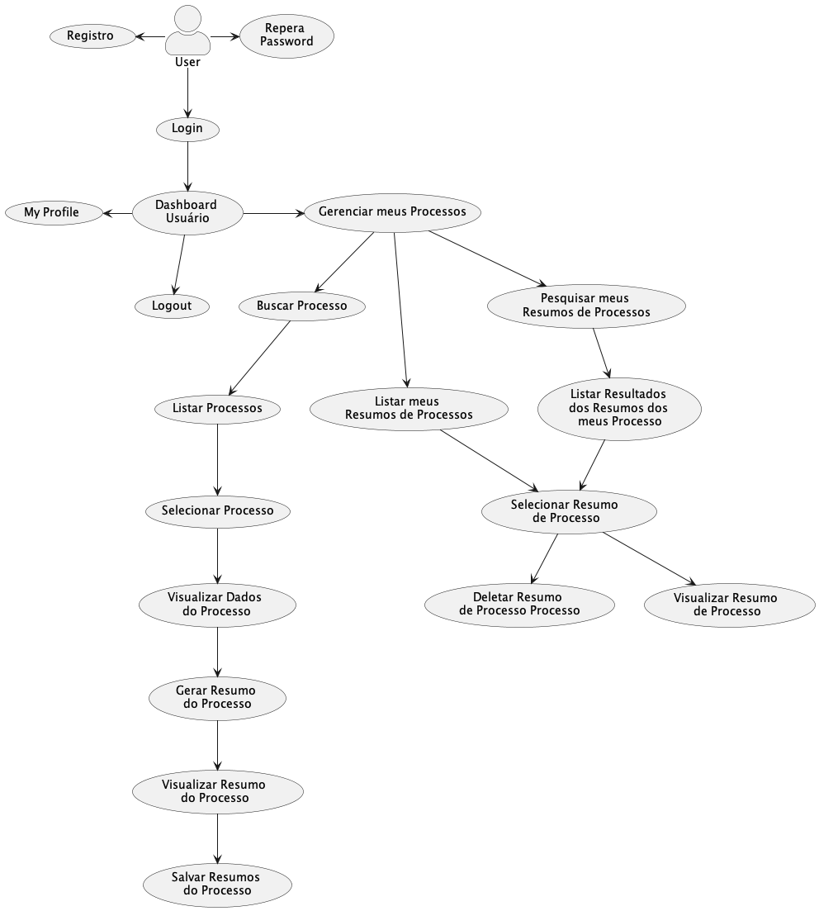

# Aplicacao Front-end para o MySummary

# A. Features Básicas

1. F1. Login
2. F2. Logout
3. F3. Registro de novo usuário
4. F4. Recuperar senha
5. F5. Gerenciar Dashboard
6. F6. Gerenciar Profile 
7. F7. Gerenciar Processos
8. F8. Gerenciar Resumo de Processo

# B. Aspectos Técnicos

- Uso do Flask para criar aplicações html dinâmicas
- Uso da biblioteca requests para consumir APIs 
- Uso do Bootstrap para criar e gerenciar componentes de UI

Revisão dos principais componentes do Bootstrap 5: 
- https://github.com/armandossrecife/mydashboard
- https://github.com/armandossrecife/mydashboard/blob/main/testes/index.html

# C. Para executar a aplicação principal

Existe uma estrutura base que vamos seguir para a construção de nossas aplicações em [Flask](https://flask.palletsprojects.com/en/2.3.x/): 

## 1. Virtual Environment

Vamos usar o esquema de [virtual environment](https://docs.python.org/3/library/venv.html)

```bash
python3 -m venv venv
```

Mais detalhes em [python venv](https://packaging.python.org/en/latest/guides/installing-using-pip-and-virtual-environments/#creating-a-virtual-environment)

### 1.1 Para ativar o venv (Linux e MacOS)

```bash
source venv/bin/activate
```

### 1.2 Para desativar o venv 

```bash
deactivate
```

## 2. Uma vez criado e ativado o venv precisamos instalar os módulos, pacotes e bibliotecas usadas pela aplicação

```bash
pip3 install -r requirements.txt
```

## 3. Configurar as variáveis de ambiente da aplicação

Opcional se a versão do Flask >= 3.0

```bash
export FLASK_APP=run.py && export FLASK_ENV=development
```
```bash
export MY_SECRET_KEY=?????????
```

## 4. Para executar a aplicação principal

```bash
flask run --host=0.0.0.0 --port=5000
```
ou você pode rodar o seguinte script bash: 
```bash
./exec.sh
```

Abra o browser: http://localhost:5000

# D. Casos de Uso

